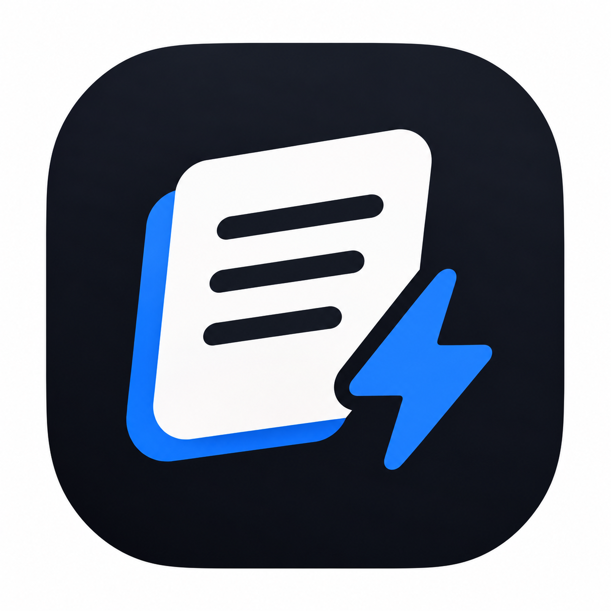

# Документация для программы QuickNotes

## Возможности

- **Записывайте** планы, мысли и другую информацию
- Записывайте информацию с помощью **голосового ввода**
- QuickNotes позволяет создавать **календари с напоминаниями**
- **Делитесь** своими планами и разработками с другими пользователями с помощью функции **Share**

## Поддерживаемые платформы

- Компьютеры
  - Windows
  - macOS
- Мобильные устройства
  - Android
  - iOS

## Установка приложения

1. Откройте **App Store** или **Google Play**
2. Наберите в поиске **QuickNotes**
3. Нажмите кнопку **Установить**
4. Введите пароль и нажмите кнопку **Продолжить**

> **Важно:** Для установки QuickNotes требуется подключение к интернету

## Запуск QuickNotes

1. Откройте терминал
2. Перейдите в папку `QuickNotes`
3. Выполните следующие команды

```bash
npm install
npm start 
```

> **Важно:** Не закрывайте терминал во время работы приложения

4. После запуска откройте `localhost:3000` в браузере.

Файл `config.json` содержит настройки приложения.

## Проверка установки

- [ ] Проверить интернет-соединение
- [ ] Скачать QuickNotes
- [ ] Запустить QuickNotes

## Полезные ссылки

- [Официальный сайт](`https://example.com`)
- [Документация](`https://example.com`)
- [Служба поддержки](`https://example.com`)

## Системные требования

| Платформа | Минимальная версия | Статус |
|---|---|---|
|Windows|10|Поддерживается
|macOS|12|Поддерживается
|Android|9|Поддерживается
|iOS|15|Поддерживается
|Linux|-|Не поддерживается

## Интерфейс приложения




## Версия документации

Текущая версия: 1.0
